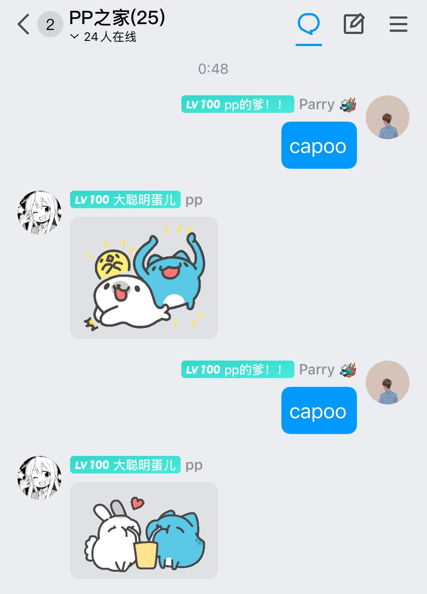
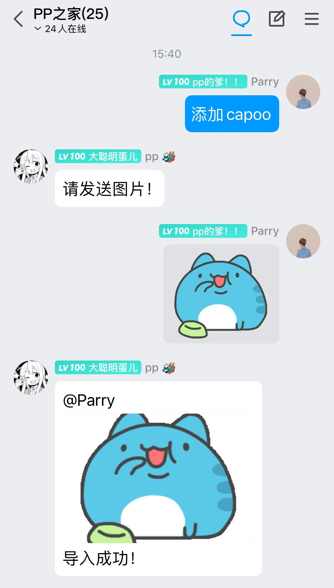
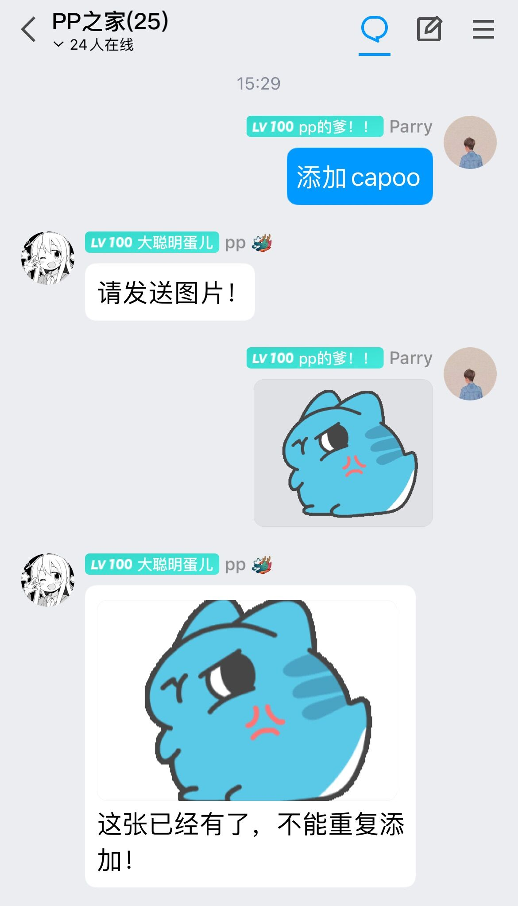

  
   
  

# nonebot-plugin-capoo

_✨ 一个发送指令就能让你的 bot 发出可爱的 capoo 的图片的插件 ✨_

## 📖 介绍

capoo 实在是太可爱了，所以我收集了几百张 capoo 的表情包。这个插件用于让 bot 发送 capoo 的表清包。

一开始的版本只能简单地从我的图源里发送表情包，在 v0.1.0 后迎来了重大更新：超级用户可以在群聊里发送指令让 bot 存储表情包。并且插件会判断这个表情包在本地的图片文件夹里是否出现过，这样能避免重复加入某张图片。

随机发送图片是利用的 sqlite3 库里的随机选择指令。

## 💿 安装

使用 nb-cli 安装

在 nonebot2 项目的根目录下打开命令行, 输入以下指令即可安装

    nb plugin install nonebot-plugin-capoo

使用包管理器安装

在 nonebot2 项目的插件目录下, 打开命令行, 根据你使用的包管理器, 输入相应的安装命令

pip

    pip install nonebot-plugin-capoo

pdm

    pdm add nonebot-plugin-capoo

poetry

    poetry add nonebot-plugin-capoo

conda

    conda install nonebot-plugin-capoo

打开 nonebot2 项目根目录下的 `pyproject.toml` 文件, 在 `[tool.nonebot]` 部分追加写入

    plugins = ["nonebot_plugin_capoo"]

## ⚙️ 配置

在 nonebot2 项目的`.env`文件中添加下表中的必填配置

| 配置项 | 必填 | 默认值 | 说明 |
|:-----:|:----:|:----:|:----:|
| capoo_download | 否 | False | 是否开启本地图片存储，True为开启本地图片存储 |

图源在 [AC Git](https://git.acwing.com/HuParry/capoo) 上，是国内的远程代码库站点，所以不用担心被墙了而发不出图片。

假如你开启了本地图片存储，插件会自己从 [AC Git](https://git.acwing.com/HuParry/capoo) 图源里下载。你也可以自行手动下载，放置在你的 bot 项目根目录下的 `data/capoo/picture` 文件夹下。

## 🎉 使用
### 指令表
| 指令 | 权限 | 需要@ | 范围 | 说明 |
|:-----:|:----:|:----:|:----:|:----:|
| `capoo` | 群员 | 否 | 群聊 | 随机发送一张 capoo 的表情包 |
| `添加capoo` | 群管 | 否 | 群聊 | 让 bot 存储图片 |

注意 `添加capoo` 指令在配置项 `capoo_download` 为 False 时将不生效。

`添加capoo` 指令会将图片储存至 `data/capoo/your_picture` 下，你可以放置图片在这个文件夹里面，插件启动后会检验这里面的图片文件。

### 效果图
#### `capoo` 指令

#### `添加capoo` 指令

## TODO
- [x] 指令触发 bot 发送图片
- [x] 在 QQ 上让 bot 存储 capoo 图片
- [x] 每次存储图片，判断图片是否已经存在，避免重复加入
- [ ] 指定某个序号的图片发送
- [ ] 由该插件衍生成一个模板插件，即仅需修改参数就能发送别的图片